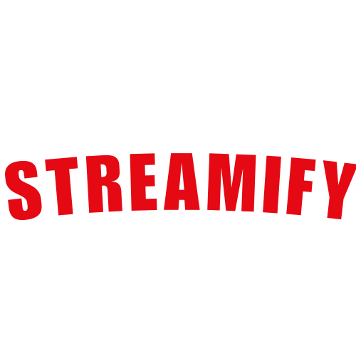

# 🎥 Streamify: A Netflix Clone Web App 🎬

Welcome to **Streamify**, a Netflix Clone Web App designed to bring back the nostalgia of the early days of streaming! Built with pure HTML and CSS, Streamify offers a seamless and engaging user experience. 🌟



## ✨ Features

- **Intuitive User Interface:** A clean and user-friendly design that makes navigation a breeze.
- **Engaging Design:** Visually appealing layouts and styles that enhance the streaming experience.
- **Accessibility:** Simple and straightforward code ensures easy access and smooth performance across devices.

## 🚀 Getting Started

To get a local copy up and running, follow these simple steps:

### Prerequisites

- A web browser (Chrome, Firefox, Safari, etc.)

### Installation

1. **Clone the repository:**
    ```sh
    git clone https://github.com/d-coder24/Streamify.git
    ```

2. **Navigate to the project directory:**
    ```sh
    cd Streamify
    ```

3. **Open `index.html` in your web browser:**
    ```sh
    open index.html
    ```

## 🤝 Contributing

Contributions are what make the open-source community such an amazing place to learn, inspire, and create. Any contributions you make are **greatly appreciated**.

1. **Fork the Project**
2. **Create your Feature Branch:** `git checkout -b feature/AmazingFeature`
3. **Commit your Changes:** `git commit -m 'Add some AmazingFeature'`
4. **Push to the Branch:** `git push origin feature/AmazingFeature`
5. **Open a Pull Request**

## 🛡️ License

Distributed under the MIT License. See `LICENSE` for more information.

## 📧 Contact

Darshan - [@darshan.coder](https://instagram.com/darshan.coder) - darshan.career24gmail.com

Project Link: [https://github.com/your-username/streamify](https://github.com/d-coder24/Streamify)

## 💬 Acknowledgements

- [Font Awesome](https://fontawesome.com)
- [Google Fonts](https://fonts.google.com)

---

⭐️ Don't forget to give the project a star if you like it! ⭐️
